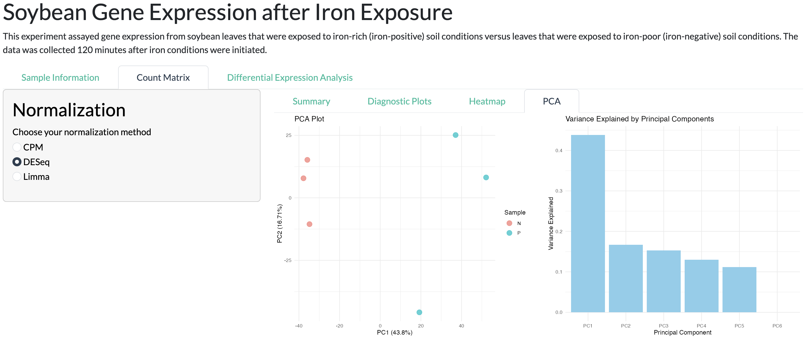

# Soybean Gene Expression Analysis App

This Shiny app is designed for analyzing gene expression data from soybean leaves exposed to iron-rich and iron-poor soil conditions. The app provides interactive tools for exploring raw counts, normalizing data, performing differential expression analysis, and visualizing results.

---

## Table of Contents

1. [Overview](#overview)
2. [Description](#description)
3. [Features](#features)
4. [Components of the Application](#components-of-the-application)
5. [Example Workflow in the App](#example-workflow-in-the-app)
6. [Interactive Options](#interactive-options)
7. [How to Use](#how-to-use)
8. [Dependencies](#dependencies)
9. [Requirements](#requirements)
10. [License](#license)

---

## Overview

This app allows users to:
- Upload gene expression data in CSV format.
- Explore sample information and raw counts.
- Normalize data using CPM, DESeq2, or Limma methods.
- Perform differential expression analysis using DESeq2, EdgeR, or Limma.
- Visualize results using interactive plots and tables.

---

## Description

This code implements an interactive web application using Shiny, an R framework for building web apps, for analyzing and visualizing soybean gene expression data in response to iron exposure. The application facilitates multiple steps of gene expression analysis, including filtering, normalization, visualization, and differential expression analysis, with results displayed through interactive tables and plots. It allows users to upload raw gene count data, perform normalization exploring 3 different methods, perform PCA (Principal Component Analysis), and differential expression analysis using DESeq2, EdgeR, or Limma. The app includes features for generating various plots such as PCA scatter plots, beeswarm plots for principal components, and volcano plots for differential expression results.

The app has three main components:
1. **Data Upload and Preprocessing**: Users upload a gene expression dataset in CSV format, which is processed to extract relevant data and metadata.
2. **Data Normalization**: Users are able to choose between 3 normalization methods (CPM, DESeq, Limma), and visualize diagnostic plots.
3. **PCA Plotting**: The app performs PCA on the uploaded data and visualizes the first two principal components. The user can choose to generate a beeswarm plot to view the distribution of the top principal components.
4. **Differential Expression Analysis**: Users can select from three different differential expression methods (DESeq2, EdgeR, Limma). The app displays the results in the form of volcano plots, showing log fold changes and p-values, with significance highlighted based on a user-defined threshold.

---

## Features

- **PCA Visualization**: Displays a scatter plot of the first two principal components and a beeswarm plot for the selected number of principal components.

- **Differential Expression Analysis**: Implements DESeq2, EdgeR, and Limma for RNA-seq data analysis. Users can compare the results of different methods side by side.
- **Volcano Plot**: Visualizes the results of differential expression analyses with customizable significance thresholds.
- **Interactivity**: The user can interact with the app by uploading files, selecting analysis methods, and adjusting visualization parameters (such as the p-value threshold for volcano plots).

---

## Components of the Application

### 1. **`app.R` (Shiny Application UI and Server)**:
   - This file handles the user interface (UI) and the server logic of the Shiny application. The UI provides components for file upload, data display, plot rendering, and selection of analysis methods. The server-side code manages data processing, computation, and plot generation based on user inputs.
   - Main UI components include:
     - File upload for RNA-seq data (CSV format).
     - Input controls for selecting the number of principal components to visualize.
     - Dropdowns to select differential expression methods.
     - Interactive plots for PCA, beeswarm, and volcano plots.

### 2. **`main.R` (Helper Functions and Plotting)**:
   - This file contains additional helper functions for formatting summary data, normalization, and visualizing the data. This file also contains functions for running differential expression analysis using DESeq2, EdgeR, and Limma. It also includes functions for performing PCA and generating plots.

### 3. **`test_app.R` (Testing Shiny Application Functionality)**:
   - This file contains unit tests for the core functions used in the Shiny app, ensuring the correctness of critical data manipulation and normalization processes. It relies on the `testthat` and `shinytest` packages to define the expected behavior of functions with mock data. Each function is tested independently with assertions to check the expected outcomes.
   - The `mock_data` used in the tests simulates gene expression data, where each row represents a gene, and each column represents a sample's count data.

---

## Example Workflow in the App

1. **Upload Gene Count Data**: Upload a CSV file containing gene expression counts. The app will process this data.
2. **Normalize Count Data**: Normalize count data using one of the selected 3 methods.
3. **Visualize PCA**: Select the number of principal components to visualize and view the PCA scatter plot and beeswarm plot.
4. **Perform Differential Expression Analysis**: Select a differential expression method (DESeq2, EdgeR, or Limma) and run the analysis.
5. **View Volcano Plot**: The app will generate a volcano plot showing the results of differential expression analysis, allowing you to customize the significance threshold and explore the results.

---

## Interactive Options

- **File Upload**: Upload your gene expression data in CSV format.
- **Filters**:
  - Filter raw counts based on minimum and maximum values.
  - Filter genes based on minimum counts for normalization.
- **Normalization**:
  - Choose between CPM, DESeq2, or Limma normalization methods.
- **Differential Expression**:
  - Select a method (DESeq2, EdgeR, or Limma) and run the analysis.
  - Adjust the p-value threshold for significance.
- **Plots**:
  - Interactive plots with tooltips and zoom options.
  - Download plots as PNG or PDF.

---

## How to Use

1. **Upload Data**:
   - Click the "Load counts data" button to upload your gene expression data in CSV format.
   - Ensure the data has a `Genes` column and sample columns (e.g., `Sample1`, `Sample2`).

2. **Explore Sample Information**:
   - Navigate to the "Sample Information" tab to view a summary of the data, raw counts table, and plots.

3. **Normalize Data**:
   - Go to the "Count Matrix" tab.
   - Choose a normalization method (CPM, DESeq2, or Limma).
   - Adjust the minimum count filter if needed.
   - Explore the normalized data, diagnostic plots, heatmap, and PCA results.

4. **Perform Differential Expression Analysis**:
   - Navigate to the "Differential Expression Analysis" tab.
   - Select a method (DESeq2, EdgeR, or Limma) and click "Run Differential Expression."
   - Adjust the p-value threshold and explore the results in tables and plots.

5. **Download Results**:
   - Use the download buttons to save summary tables, normalized data, or plots.

---

## Dependencies

This app requires the following R packages:
- `shiny`
- `bslib`
- `ggplot2`
- `tidyverse`
- `DESeq2`
- `edgeR`
- `limma`
- `DT`
- `pheatmap` (optional for enhanced heatmaps)
- `viridis` (optional for color scales)

Install the dependencies using:

```r
install.packages(c("shiny", "bslib", "ggplot2", "tidyverse", "DESeq2", "edgeR", "limma", "DT", "pheatmap", "viridis"))
